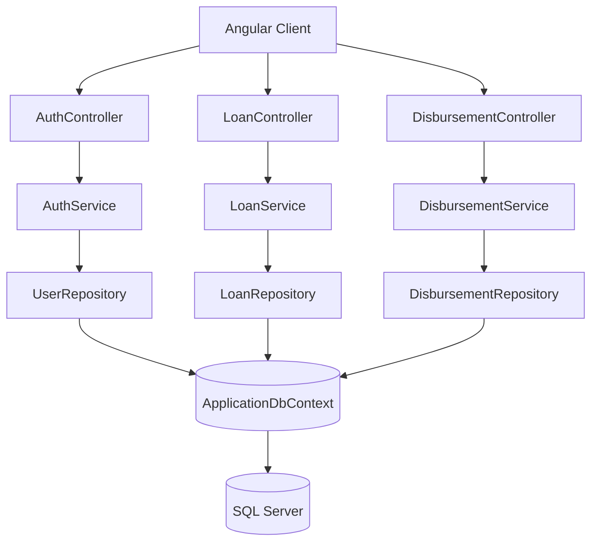

# Loan Disbursement System Backend

ASP.NET Core Web API backend for loan and disbursement management with JWT authentication and SQL Server persistence.

## Project Description

The backend provides:

- Authentication endpoint for JWT issuance
- Protected Loan APIs for CRUD operations
- Protected Disbursement APIs for create and read operations
- Entity Framework Core data access using repository and service layers
- Seed sample data for local development

## Technology Stack

- .NET 8
- ASP.NET Core Web API
- Entity Framework Core
- SQL Server
- JWT Bearer Authentication

## Architecture Flow

## API Groups

- Auth
  - POST /api/auth/login
- Loan (JWT required)
  - GET /api/loan
  - GET /api/loan/{id}
  - POST /api/loan
  - PUT /api/loan/{id}
  - DELETE /api/loan/{id}
- Disbursement (JWT required)
  - GET /api/disbursement
  - GET /api/disbursement/{id}
  - POST /api/disbursement

## Run Backend

1. Ensure SQL Server connection string is configured in appsettings.json.
2. Apply migrations:
   - dotnet ef database update
3. Run API:
   - dotnet run --project LoanDisbursementSystem.csproj --urls http://localhost:5148

## Security Notes

- JWT authentication is enabled.
- Loan and Disbursement controllers are protected with authorization.
- CORS policy allows configured local UI origins.
