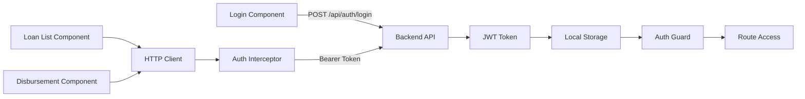

# Loan Disbursement UI

Angular frontend for the Loan Disbursement System. It provides login, loan management, and disbursement management screens integrated with the backend API.

## Project Description

The UI supports:

- Login with username and password
- JWT token handling for authenticated API requests
- Loan CRUD operations
- Disbursement creation and listing
- Dashboard-based workflow for daily loan operations

## Frontend Architecture Flow

## Key UI Modules

- Login component
	- Authenticates user and stores JWT token
- Dashboard component
	- Hosts loan and disbursement modules
- Loan List component
	- Displays loans and supports create, update, delete
- Disbursement component
	- Displays disbursements and supports new disbursement creation

## Run Frontend

1. Install dependencies:
	 - npm install
2. Start development server:
	 - npm run start -- --port 4301
3. Open:
	 - http://localhost:4301

## Important Path Note

If your workspace path contains #, Vite SSR/dev module loading may fail.

Recommended options:

- Use a path alias without # using subst on Windows, then run npm start from that alias.
- Or move the project to a directory path that does not include #.

## Build

- npm run build

## Backend URL

- Expected API base URL: http://localhost:5148
