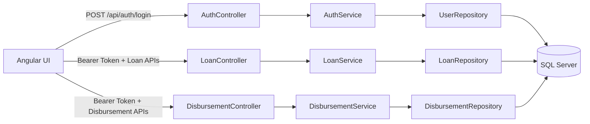

# Loan Disbursement System

Loan Disbursement System is a full-stack application for managing loan records and loan disbursement operations with JWT-secured APIs.

This repository contains:

- Backend API: ASP.NET Core Web API with Entity Framework Core and SQL Server
- Frontend UI: Angular application for login, loan operations, and disbursement operations

## Project Description

The platform supports:

- User login and JWT token generation
- Secure access to loan and disbursement APIs
- Loan lifecycle operations (create, view, update, delete)
- Disbursement creation and listing
- Seed sample data for users, customers, loans, and disbursements in development

## High-Level Architecture Flow

## Authentication Flow

1. User logs in using username/password.
2. API returns JWT token on successful authentication.
3. UI stores token and sends it in Authorization header as Bearer token.
4. Loan and Disbursement endpoints are authorized and reject missing/invalid tokens.

## Repository Structure

- LoanDisbursementSystem: Backend API project
- LoanDisbursementUI: Angular frontend project

## Documentation

- Backend documentation: [LoanDisbursementSystem/README.md](LoanDisbursementSystem/README.md)
- Frontend documentation: [LoanDisbursementUI/README.md](LoanDisbursementUI/README.md)